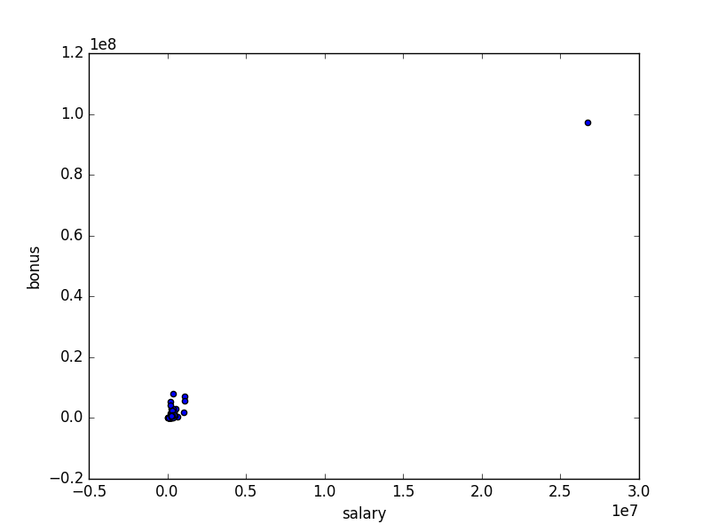

# Identify Fraud from Enron Email

## Introduction

As part of Udacity's Data Analyst Nanodegree I analyse the Enron Email Dataset
[cmu2015]. The Enron incident was one of the biggest fraud cases in the US history.
The email dataset was released after Enron's bankrupcy during the investigation 
of the Federal Energy Regulatory Commision. The total corpus contains about 0.5M 
messages [cmu2015] and is probably the biggest release of real email messages
ever made public.

The final goal of this project is to identify persons of interest (POI) with
the help of a machine learning algorithm.

## Goal and Dataset

We want to analyse the emails and additionally financial data (provided by 
Udacity) of former Enron employees. In the end we want to be able to identify
persons of interest based on their features - e.g. email contents or financial
data.

### POI definition

A POI is defined as someone who:

- was indicted
- settled without admitting guilt
- testified in exchange for immunity

*(Definition from Lesson 5 - "What is a POI")*

Udacity marked 35 people as POI based on this definition and provided a list 
of names ("poi\_names.txt") as well as preprocessed data sets with approprioate 
POI labels.

### Process

For the identification of POIs we want to facilitate machine learning, which 
has shown very good results for classification and regression tasks. Especially
for big text corpus processing or Natural Language Processing (NLK), it is 
probably the only feasible way to effectively find patterns.

We will first analyse the dataset in general and try to find any issues, such
as outliers. Then we will take a look at the features and generate new one, as
needed. With the selected features we train a algorithm. We will try different
algorithms and parameters and see which works best. Finally we evaluate our
results and adjust the configuration as necessary.

### Possible Problems

One problem in our case is that the set of POIs is relatively small. While we
also want to verify the performance of our models, we have to be carful with
our feature selection and the conclusions we draw. Most employees are not a
POI and its therefore likely that identifying someone as non-POI is correct.
We will try to mitigate this problem by some different validation metrics.

## General Data Exploration

### Dataset Structure

The email and financial dataset provided by Udacity includes the financial 
data and some communication features of 146 employees. It has the following 
structure (as explored in Lesson 5 - "data-questions.py"):

- Dictionary of 146 persons (keys) and their data (dictionary)
- There are 21 features per person
- Includes 18 persons marked as POI

List of all features (alphabetically):

- bonus
- deferral_payments
- deferred_income
- director_fees
- email_address
- exercised_stock_options
- expenses
- from_messages
- from_poi_to_this_person
- from_this_person_to_poi
- loan_advances
- long_term_incentive
- other
- poi
- restricted_stock
- restricted_stock_deferred
- salary
- shared_receipt_with_poi
- to_messages
- total_payments
- total_stock_value

Because there is no complete data for every person, several features are 
filled with "NaN". Here are the features that have 'NaN' for every second
person or more (more than 73 NaN values):

| No. of NaNs | Feature Name 
| ----------- | ------------ 
| 80 	      | long_term_incentive
| 97 	      | deferred_income
| 107 	      | deferral_payments
| 128 	      | restricted_stock_deferred
| 129 	      | director_fees
| 142 	      | loan_advances

With these features we have to be careful, because less then half of the
persons do not have any value for them.

### Outliers

Taking a look at the salary and bonus values we can see a major outlier 
in the plot. It is some magnitudes higher for both bonus and salary.

When we take a closer look at the exact values and compare it with the
information provided in the "enron61702insiderpay.pdf" document, we find
out that the outlier is the total amount of all persons.

This was probably some spreadsheet error. We take it out for our further 
studies.

After removing the outlier and plotting the data again, we see four more
data points that are outstanding.

Again comparing it with the insider pay document, we find out that the new
outliers include the former (infamous) CEOs "Kenneth Lay" and "Jeffrey 
Skilling". It makes no sense to take out these data points.
 

## References

**[cmu2015]** - Enron Email Dataset (May 7, 2015 Version of dataset), William W. Cohen, MLD, CMU
http://www.cs.cmu.edu/~enron/
